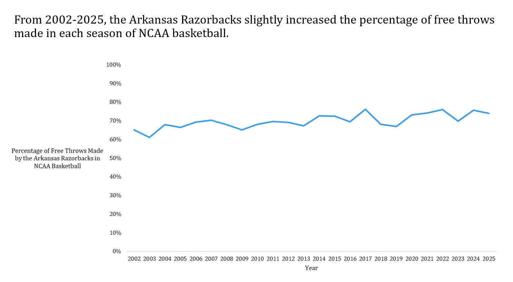
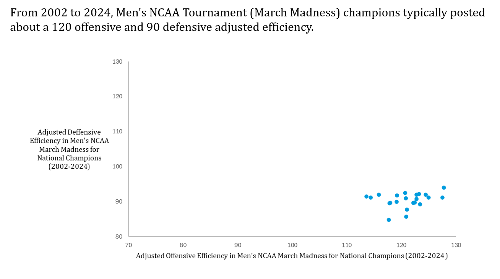
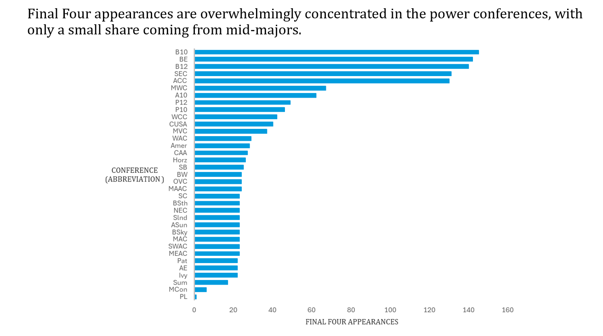

### **Team Members**

- **Nate Crain** — [e-Portfolio Link](https://natejcrain.quarto.pub/ineg-project/)
- **Matthew Goodwin** — [e-Portfolio Link](https://mattg5.quarto.pub/matthew-goodwin/)
- **Gayle Taylor** — [e-Portfolio Link](https://cgtaylor.quarto.pub/gayletaylorportfolio/)

## **About the Dataset**

For this project, our team used a comprehensive March Madness dataset compiled from historical NCAA men’s basketball statistics. The dataset includes: - Efficiency metrics (offensive, defensive, adjusted) - Coaching information (current coach, years at program, tenure index) - Tempo and possession statistics - Shooting percentages - Conference information - Post-season outcomes (Final Four, Championship, etc.) The dataset allowed us to explore meaningful numerical and categorical variables, compare team performance across years, and answer four different analytical questions using Excel and data visualization techniques.

## 1. What is the distribution of coaching experience in the 2024 tournament teams?

**Why It’s Interesting:** We wanted to see whether tournament teams are usually led by long-tenured coaches or if programs with newer coaches are still making the field. The dataset only tracks how long a coach has been at their current school, which is helpful because many coaches switch programs. That means “experience” doesn’t always equal total coaching years, and that difference made this question interesting to explore.

**How We Used Excel:** We filtered the dataset to Season = 2024 and Post-Season Tournament = March Madness. We then used the **Active Coaching Length Index** column and taking that information, created a histogram with 5-year interval bins.

**How We Developed the Visual:** We saw that using a histogram would showcase the trend that coaches with newer programs were far outpacing long-tenured coaches in the 2024 March Madness tournament. We decided that using the official NCAA tournament colors would be a nice touch.

{fig-align="center" width="80%"}

## 2. How has the Arkansas Razorbacks’ free-throw percentage changed from 2002–2025?

**Why It’s Interesting:** Free throws can swing tournament games, so analyzing long-term accuracy helps reveal whether Arkansas has improved at a fundamental skill over time.

**How We Used Excel:** We filtered the dataset to keep rows where Mapped ESPN Team Name = “Arkansas Razorbacks.” Then we used the **FTPct** column (free-throw percentage) and arranged the values across the **Season** variable from 2002–2025. We plotted these in a time series line chart to show how the Razorbacks’ free-throw accuracy has changed over the years.

**Visual Development:** We felt that narrowing down to one team would show a better trend and as proud Razorback fans, we focused on our home team. We still kept with the overall NCAA visual. The main adjustments that were needed were cleaning up the graph and getting rid of clutter.

{fig-align="center" width="80%"}

## 3. What relationship exists between offensive and defensive adjusted efficiency among NCAA champions from 2002–2024?

**Why It’s Interesting:** Championship teams typically combine strong offense with elite defense. This visualization helps quantify that pattern.

**How We Used Excel:** We filtered the dataset to include only teams with Post-Season Tournament = March Madness and Tournament Winner = TRUE. For each champion, we used the **Adjusted Offensive Efficiency (AdjOE)** and **Adjusted Defensive Efficiency (AdjDE)** columns. We plotted these values as points on a scatterplot to show how offensive and defensive efficiency relate among national champions.

**Visual Development:** We highlighted the cluster pattern showing most champions fall near \~120 offensive and \~90 defensive efficiency. We intentionally made the x-axis 70-130 and the y-axis 80-130 to show the full scope of all tournament teams; this allows us to highlight that champions fall a cluster and could be used for forecasting the 2025 champion.

{fig-alt="Scatter plot showing adjusted offensive efficiency on the x-axis and adjusted defensive efficiency on the y-axis for NCAA March Madness champions from 2002 to 2024." width="100%"}

## 4. Which conferences have produced the most Final Four teams?

**Why It’s Interesting:** Conference strength is a long-running NCAA debate. This chart shows whether "power conferences," such as the SEC, Big 10, ACC, and others dominate Final Four appearances.

**How We Used Excel:** We filtered the dataset to include all teams in the Post-Season Tournament = March Madness. From there, we pulled the **Region** column and the **Final Four?** indicator to count how many teams from each region made the Final Four. We then plotted those totals in a horizontal bar chart to compare Final Four representation across regions.

**Visual Development:** We used a horizontal bar chart and sorted conferences in descending order of Final Four appearances so the power conferences are easy to spot at the top. Because there are so many conferences, we kept the labels as abbreviations on the axis and added a link to a full list of conference names and abbreviations for reference [College Basketball Conferences – Fox Sports](https://www.foxsports.com/college-basketball/conferences).

{width="100%"}
