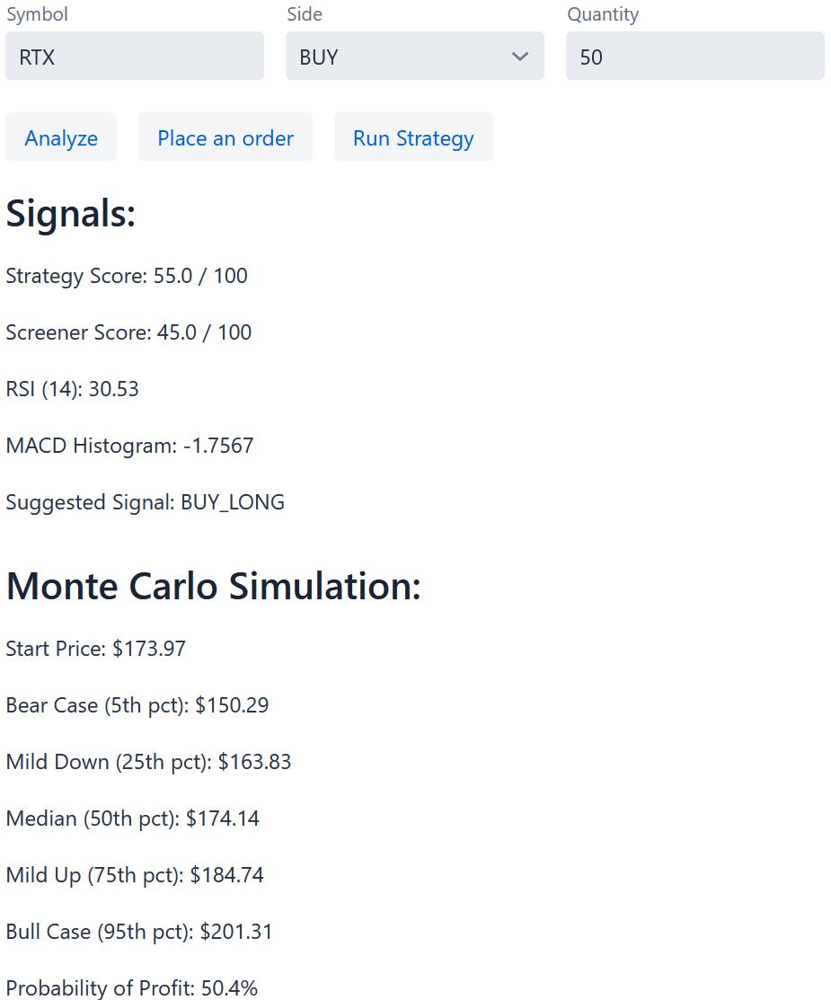
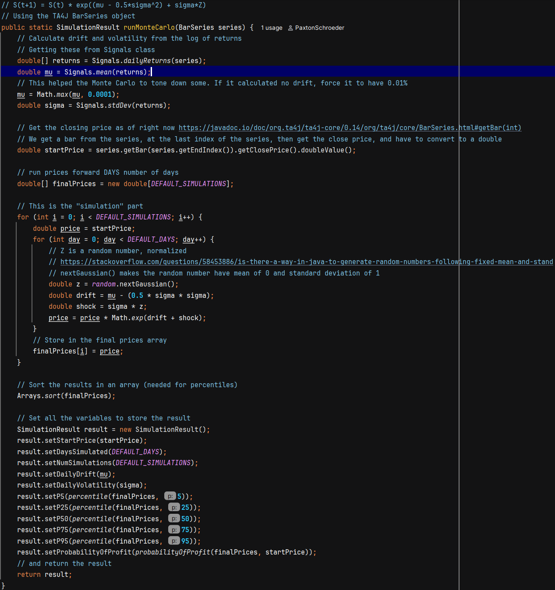
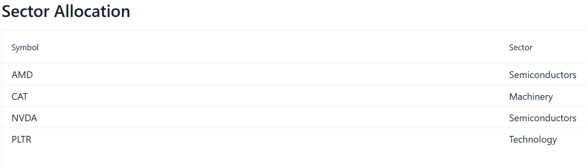

### **Team Members**

- **Nick Colosimo** -- <https://nickcolosimo.quarto.pub/nicholas-colosimo>
- **Chase Stanton** -- <https://chasestanton.quarto.pub/chase-stanton/>

## **Project Summary and Skills Used**

Our team independently created a website that we can use to make paper trades in the stock market.The user can view open positions, make trades, and analyze potential trades. The code runs a Monte Carlo simulation with Geometric Brownian Motion to extrapolate future prices. This project was written in Java 21 with a lot of custom classes and methods. We used Technical Analysis for Java (TA4J) to do technical analysis on any stock in the IEX feed. The team utilized a Java wrapper for the Alpaca API for stock information imports and order submissions. Finnhub API is used to fetch sector information.We all worked together on the same files, so we had to learn how to use GitHub effectively, without messy merge conflicts.

## **Project Development Process**

Our original idea was to create a system that automatically screens a selection of available stocks, takes past price and volume data from that stock, and automatically places an order including entry price, take-profit, and stop-loss. We had to cut down on scope by requiring the user to input a ticker for the program to analyze and then automatically place an order after doing a calculation because we were hitting API rate limits very quickly. There was less documentation than originally thought available, so we had to do extensive reading of the alpaca-java JavaDoc and read the documentation from the Alpaca website written in JavaScript, then make educated guesses about packages and parameters. We had trouble getting the API initialized and making the simulations consistently work. Furthermore, we encountered a null bars error when making trades on the weekend or early on Mondays because the market was closed or recently closed. We fixed this by starting our lookback from a maximum of five months, then moving forward to the present, collecting the most recent one hundred bars. The program is unable to do exactly what we desired without paying for the API, which might be worth it were the program to be used with actual swing trading.

## **Key Features**

The Monte Carlo simulation that uses Geometric Brownian Motion to predict stock prices, incorporating randomness, gives several price predictions at varying market conditions (bull, bear, strong bull, etc.). The output of the analyze button looks like this:And here is the code that makes it work:

I am proud of utilizing the Finnhub API to retrieve sector information. This data is not available via Alpaca API, so we needed to use something else. We utilized Java's URL object, InputStreamReader(), and the split() method to read the Finnhub data from the web and return the sector for any ticker.

## **Reflection**

Throughout working on this project, I have deepened my understanding about how many interdependent classes and methods can work together and how Spring can help classes to share information. We learned a lot about how multiple people should work on code at the same time, utilizing GitHub, which was new. I personally implemented the majority of the code for the Vaadin views, Alpaca API configuration, and converted the arrays of imported price and volume data to TA4J's BarSeries object. I learned how important it is to push often, to resolve merge conflicts, and how to read documentation to learn packages that are new to me. I feel confident creating complex programs that have many different deliverables. I can utilize an API effectively and work with imported data.
